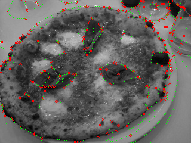
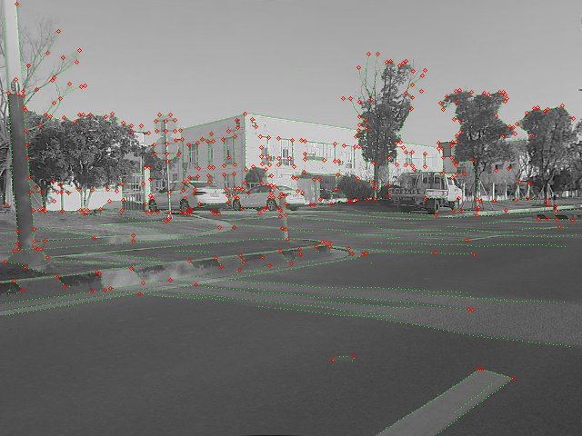
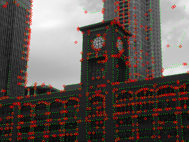
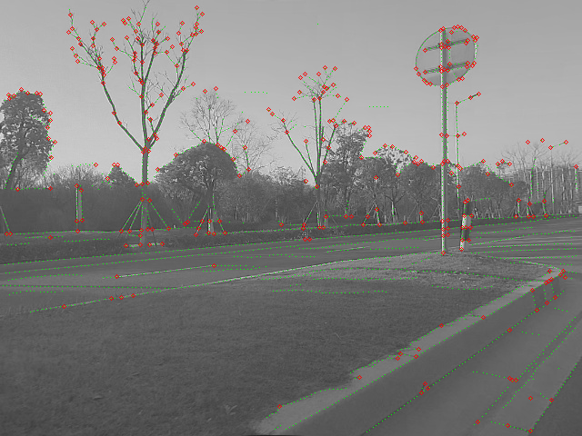
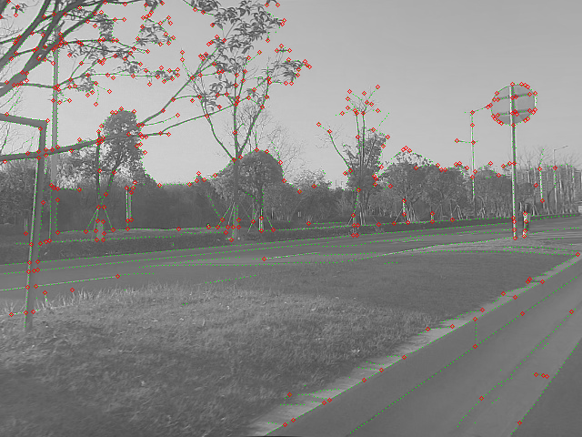
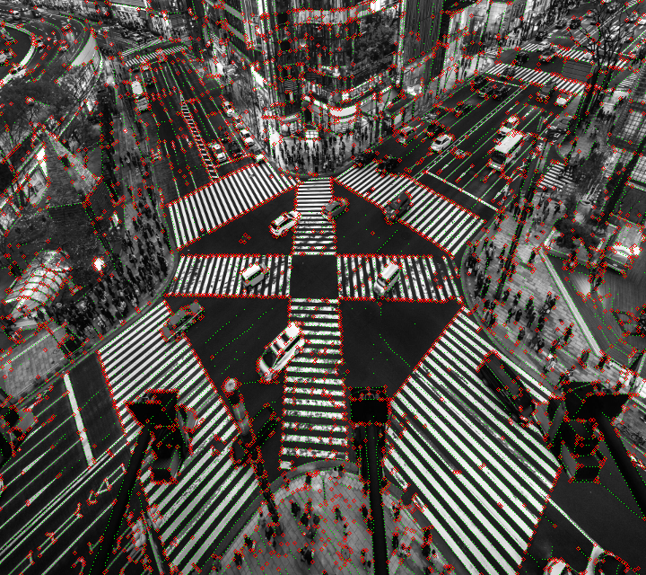
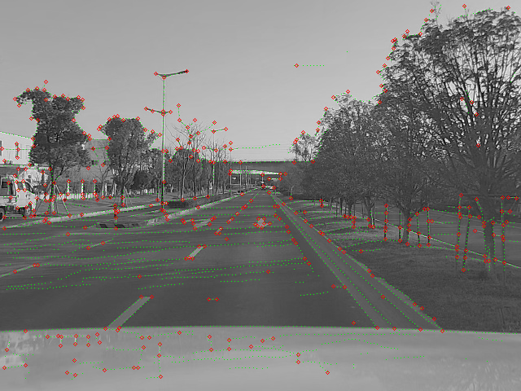

# SuperEdge
A superpoint based Edge detection method. SuperEdge can be used to extract object edges and perform edge matching. This project is still under development and the current visual effect is as follows.

| coco |road |
|--|--|
|   | | 
|   | | 
|   | | 
|   | | 
