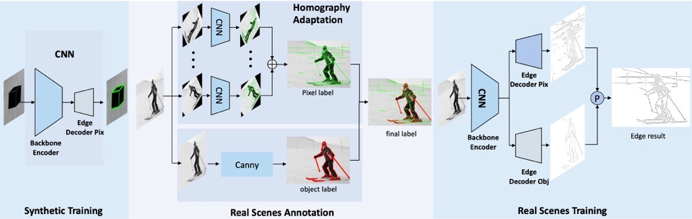

# SuperEdge
SuperEdge is a self-supervised edge detection method.
I have finished organizing the code, but because the paper was not accepted and I am too busy recently, I have not uploaded it to GitHub. 

My email address is playtomarslk@gmail.com. If you are interested in SuperEdge, send me an email and I will send you the code.


## Pipeline Overview



# Install requirements
```
conda create -n SuperEdge python=3.7

conda activate SuperEdge

pip install -r requirements.txt

conda install pytorch==1.9.0 torchvision==0.10.0 cudatoolkit=11.1 -c pytorch -c nvidia
```

# Evaluation
Modify *./config/visual.yaml* to suit your path.
```
python evaluate.py
```
See *./results* for result.

# Train SuperEdge
## Training Pipeline
1. Train SuperEdge on Synthetic Dataset. 
This operation will generate a synthetic dataset and train an edge prediction model on this dataset.
```python
python train.py ./config/syn_train.yaml
```


2. Homography Adaptation, from synthetic to real-world. 
```
python homography_adaptation.py ./config/HA_syn2coco.yaml
```

3. Train SuperEdge on cocov1.
```
python train.py ./config/cocov1_train.yaml
```
4. Homography Adaptation, coco relabel
```
python homography_adaptation.py ./config/HA_coco2coco.yaml
```
5. object-level edge label
```
python object_level_label.py
```

# Edge detection evaluation tool
All the data presented in this paper are obtained by using [edge_eval_python](https://github.com/Walstruzz/edge_eval_python).

# Acknowledgement
The code is modified based on [Superpoint-pytorch](https://github.com/shaofengzeng/SuperPoint-Pytorch), thanks to its open source.

In addition, the following work is also of great help to SuperEdge.

- **STEdge** https://github.com/yunfan1202/STEdge
- **DexiNed** https://github.com/xavysp/DexiNed
- **SOLD^2** https://github.com/cvg/SOLD2
- **SuperPoint** https://github.com/rpautrat/SuperPoint
